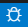
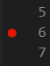

# Debugger

## How to use the debugger in VS Code with a CMake project

If you have the C++, CMake and CMake Tools extensions installed on VS Code and you are browsing a CMake project you should see a bug on your bottom toolbar next to the normal play button.

Using the debugger is exactly the same as the play button except if the debugger runs into an exception or a breakpoint

### Setting a breakpoint

To set a breakpoint, click to the left of the line number you want to set it before. For example, if I place a breakpoint on line 5, the code will run up until line 5 and stop right before it is executed.

Breakpoints will automatically get moved to the next statement when you run the debugger.

# Paused on breakpoint

## P

## Call Stack

## Locals

## Breakpoint Types

## Best Practices for Breakpoint Positioning